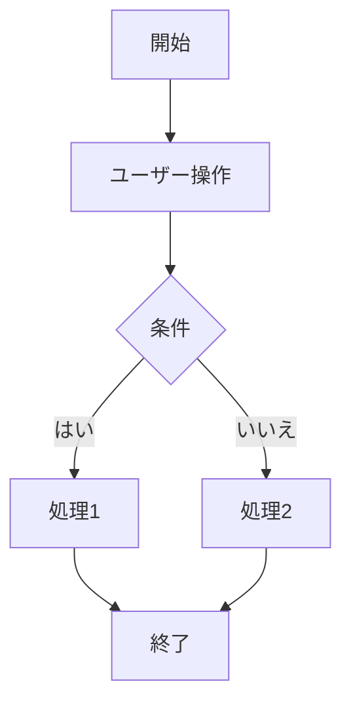

# 業務フロー（テンプレート）

## シナリオ概要
- 名称：
- 目的：
- トリガー：
- 前提条件：
- 結果/完了条件：

## 役割 / システム
| 役割/システム | 説明 |
|---|---|
| ユーザー |  |
| 管理者 |  |
| 外部システムA |  |

## 基本フロー
| No | 担当 | アクション | システム応答 | 備考 |
|---|---|---|---|---|
| 1 | ユーザー |  |  |  |
| 2 | システム |  |  |  |

## 代替/例外フロー
| No | 条件 | 対応 | 備考 |
|---|---|---|---|
| E1 |  |  |  |

## 入出力データ
| タイミング | 入力 | 出力 | 格納先 | 備考 |
|---|---|---|---|---|
| 基本1 |  |  |  |  |

## ビジネスルール / 判定（任意）
| ルールID | 内容 | 判定基準 | 例外 |
|---|---|---|---|
| BR-01 |  |  |  |

## 図（任意）
- 図の配置先：Figma/画像、または下記にMermaidで記載

