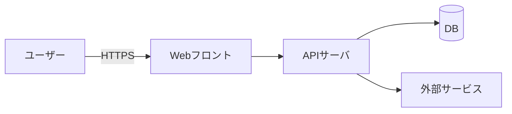

# システム構成（テンプレート）

## 概要
- システムの全体像と境界。主要コンポーネント/外部連携を一言で。

## 環境
| 環境 | 目的 | URL/エンドポイント | 認証 | 備考 |
|---|---|---|---|---|
| Dev | 開発 |  |  |  |
| Stg | 確認 |  |  |  |
| Prod | 本番 |  |  |  |

## コンポーネント一覧
| ID | 名称 | 役割 | 技術/サービス | 所有 | 備考 |
|---|---|---|---|---|---|
| C-01 | Webフロント | UI提供 | React/Next 等 | FE |  |
| C-02 | APIサーバ | 業務処理 | Node/Go/Ruby 等 | BE |  |
| C-03 | DB | データ永続化 | RDB（PostgreSQL等） | Infra |  |

## 外部依存・連携
| 連携先 | 種別 | 用途 | 認証 | 備考 |
|---|---|---|---|---|
| 決済サービス | REST | 課金 | API key |  |

## ネットワーク/セキュリティ（要点）
- VPC/サブネット、FW/SG、WAF、TLS、秘密情報管理の方針

## 図（任意）

